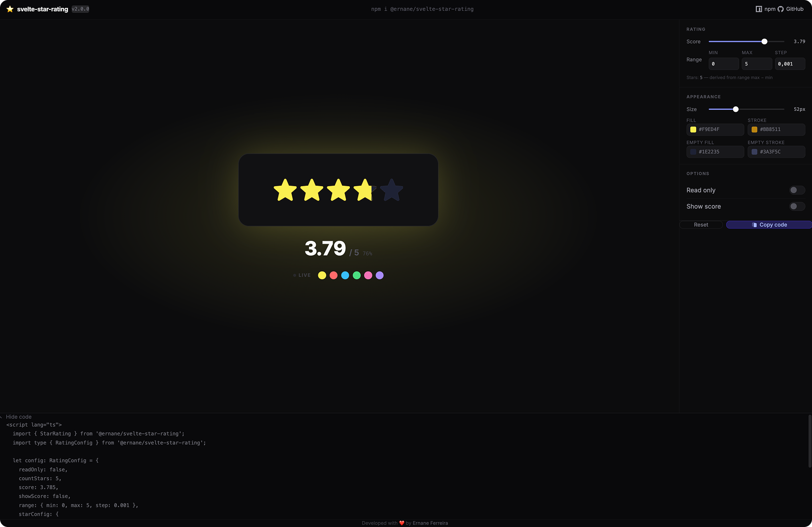

<div align="center">

# ✨ Svelte Star Rating ✨

**Lightweight, fully customizable star rating component for Svelte — with TypeScript support, fractional stars, and zero runtime dependencies.**

[](https://www.npmjs.com/package/@ernane/svelte-star-rating)
[](https://github.com/ErnaneJ/svelte-star-rating/actions)
[](https://www.typescriptlang.org/)
[](https://svelte.dev/)
[](./LICENSE)
[](https://www.npmjs.com/package/@ernane/svelte-star-rating)

[**→ Live Demo**](https://ernanej.github.io/svelte-star-rating/) &nbsp;·&nbsp;
[**npm**](https://www.npmjs.com/package/@ernane/svelte-star-rating) &nbsp;·&nbsp;
[**Changelog**](./CHANGELOG.md) &nbsp;·&nbsp;
[**Contributing**](./CONTRIBUTING.md)

<a href="https://ernanej.github.io/svelte-star-rating/">
  
</a>

</div>

## Features

- **Zero dependencies** — pure Svelte, no external runtime packages
- **TypeScript-first** — full type declarations shipped out of the box, fixing [#18](https://github.com/ErnaneJ/svelte-star-rating/issues/18)
- **Fractional ratings** — render 3.7 ★ with smooth SVG gradient fills
- **Flexible API** — all config fields are optional; defaults just work
- **Accessible** — `aria-label` on the range input, `aria-hidden` on decorative SVGs
- **Svelte 4 + 5** — works in both major versions via legacy-compatible syntax
- **Read-only mode** — display ratings without any interaction

## Installation

```bash
npm install @ernane/svelte-star-rating
```

```bash
pnpm add @ernane/svelte-star-rating
```

```bash
yarn add @ernane/svelte-star-rating
```

## Quick start

```svelte
<script lang="ts">
  import { StarRating } from '@ernane/svelte-star-rating';
  import type { RatingConfig } from '@ernane/svelte-star-rating';

  let config: RatingConfig = {
    score: 3.5,
    countStars: 5,
    showScore: true,
  };
</script>

<StarRating bind:config on:change={(e) => console.log('score:', e.currentTarget.value)} />
```

Default export also works:

```svelte
<script lang="ts">
  import StarRating from '@ernane/svelte-star-rating';
</script>

<StarRating />
```

## Configuration

All fields are **optional**. Omitted fields fall back to the defaults shown below.

```typescript
import type { RatingConfig } from '@ernane/svelte-star-rating';

const config: RatingConfig = {
  readOnly:    false,       // display-only, no interaction
  countStars:  5,           // number of star icons
  score:       0,           // current rating value
  showScore:   true,        // show the score label
  name:        'stars',     // name attribute on the hidden range input

  range: {
    min:  0,
    max:  5,
    step: 0.001,            // slider precision
  },

  // custom label — receives (score, totalStars) as arguments
  scoreFormat: (score, total) => `${score.toFixed(1)} / ${total}`,

  starConfig: {
    size:                30,        // px
    fillColor:           '#F9ED4F', // filled star
    strokeColor:         '#BB8511', // filled star border
    unfilledColor:       '#FFF',    // empty star
    strokeUnfilledColor: '#000',    // empty star border
  },
};
```

### `RatingConfig` reference

| Property | Type | Default | Description |
|---|---|---|---|
| `readOnly` | `boolean` | `false` | Disables the slider |
| `countStars` | `number` | `5` | Number of star icons |
| `score` | `number` | `0` | Current rating value |
| `showScore` | `boolean` | `true` | Show the score label |
| `name` | `string` | `'stars'` | `name` on the range `<input>` |
| `range.min` | `number` | `0` | Slider minimum |
| `range.max` | `number` | `5` | Slider maximum |
| `range.step` | `number` | `0.001` | Slider step (precision) |
| `scoreFormat` | `(score: number, total: number) => string` | `undefined` | Custom score formatter |
| `starConfig.size` | `number` | `30` | Star size in px |
| `starConfig.fillColor` | `string` | `'#F9ED4F'` | Color of filled stars |
| `starConfig.strokeColor` | `string` | `'#BB8511'` | Border of filled stars |
| `starConfig.unfilledColor` | `string` | `'#FFF'` | Color of empty stars |
| `starConfig.strokeUnfilledColor` | `string` | `'#000'` | Border of empty stars |

### Exported types

```typescript
import type {
  RatingConfig,         // full component config (all optional)
  StarConfig,           // starConfig subset
  ResolvedRatingConfig, // config with all defaults applied
} from '@ernane/svelte-star-rating';
```

## Events

The component forwards events from the underlying range `<input>`:

| Event | When | `e.currentTarget` |
|---|---|---|
| `on:change` | User releases the slider | `HTMLInputElement` |
| `on:input` | Every drag tick (real-time) | `HTMLInputElement` |
| `on:click` | Any click on the stars area | `HTMLInputElement` |

```svelte
<StarRating
  bind:config
  on:change={(e) => console.log('final value:', e.currentTarget.value)}
  on:input={(e) => console.log('live value:', e.currentTarget.value)}
/>
```

## Examples

### Read-only / display mode

```svelte
<StarRating config={{ readOnly: true, score: 4.3, countStars: 5 }} />
```

### Custom colors

```svelte
<StarRating config={{
  score: 3,
  starConfig: {
    fillColor: '#ff6b6b',
    strokeColor: '#c0392b',
    unfilledColor: '#f5f5f5',
    strokeUnfilledColor: '#ccc',
  },
}} />
```

### Custom score label

```svelte
<StarRating config={{
  score: 4,
  countStars: 5,
  showScore: true,
  scoreFormat: (score, total) => `${score.toFixed(1)} out of ${total}`,
}} />
```

### Multiple independent ratings

```svelte
<script lang="ts">
  import { StarRating } from '@ernane/svelte-star-rating';
  import type { RatingConfig } from '@ernane/svelte-star-rating';

  let quality: RatingConfig = { name: 'quality', score: 4 };
  let value: RatingConfig   = { name: 'value',   score: 3 };
</script>

<label>Quality</label>
<StarRating bind:config={quality} />

<label>Value</label>
<StarRating bind:config={value} />
```

### SvelteKit

Works out of the box — no additional config needed.

```svelte
<!-- src/routes/+page.svelte -->
<script lang="ts">
  import { StarRating } from '@ernane/svelte-star-rating';
</script>

<StarRating />
```

## Migrating from v1

### `scoreFormat` signature

**v1** used `this` (incompatible with TypeScript strict mode):

```js
// ❌ v1
scoreFormat: function () { return `(${this.score}/${this.countStars})`; }
```

**v2** receives values as arguments:

```ts
// ✅ v2
scoreFormat: (score, total) => `(${score}/${total})`
```

### Partial config

In v2, all `RatingConfig` fields are optional — you no longer need to pass a complete object.

```ts
// ✅ valid in v2
const config: RatingConfig = { score: 3 };
```

### Peer dependency

The peer dependency changed from `svelte ^3` to `svelte >=4.0.0`.

## Development

```bash
git clone https://github.com/ErnaneJ/svelte-star-rating.git
cd svelte-star-rating
npm install

npm run dev          # start the interactive demo at localhost:5173
npm run check        # TypeScript + svelte-check
npm test             # run Vitest tests
npm run package      # build the library into dist/
```

## Contributing

Contributions are welcome! Please read [CONTRIBUTING.md](./CONTRIBUTING.md) before opening a PR.

## License

[MIT](./LICENSE) © [Ernane Ferreira](https://www.ernane.dev)